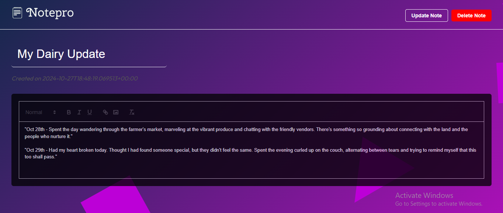

## NotePro

**NotePro** offers a versatile platform for all your note-taking needs, helping you stay focused and in control. With a sleek frontend built using Vite and React, and a robust backend powered by Supabase, NotePro provides secure user authentication and encrypted storage for your notes. You can create, update, and delete notes while ensuring that your content remains private and protected.

### Features

- **User Authentication**: Managed through Supabase Auth.
- **Encrypted Notes**: Content is encrypted before being stored in the database.
- **CRUD Operations**: Easily create, read, update, and delete notes.
- **Responsive Design**: Built with React for a smooth and responsive user experience.

---

## Getting Started

Follow these steps to get a local copy up and running.

### Prerequisites

- [Node.js](https://nodejs.org/) installed on your local machine.

### Installation

1. **Clone the repository:**

   ```bash
   git clone https://github.com/CodeDevvv/NotePro.git
   ```

2. **Navigate to the project directory:**

   ```bash
   cd NotePro
   ```

3. **Install dependencies:**

   ```bash
   npm install
   ```

4. **Start the development server:**

   ```bash
   npm run dev
   ```

5. Open your browser and go to `http://localhost:5174` to view the app.

---

## Preview

Here’s a preview of what NotePro looks like:

### Home


### Register


### Dashboard


### Create Note


### Update Note


### Unauthorized


### Acknowledgements

Special thanks to [Supabase](https://supabase.com/) for the backend infrastructure and [Vite](https://vitejs.dev/) for the seamless development experience.
